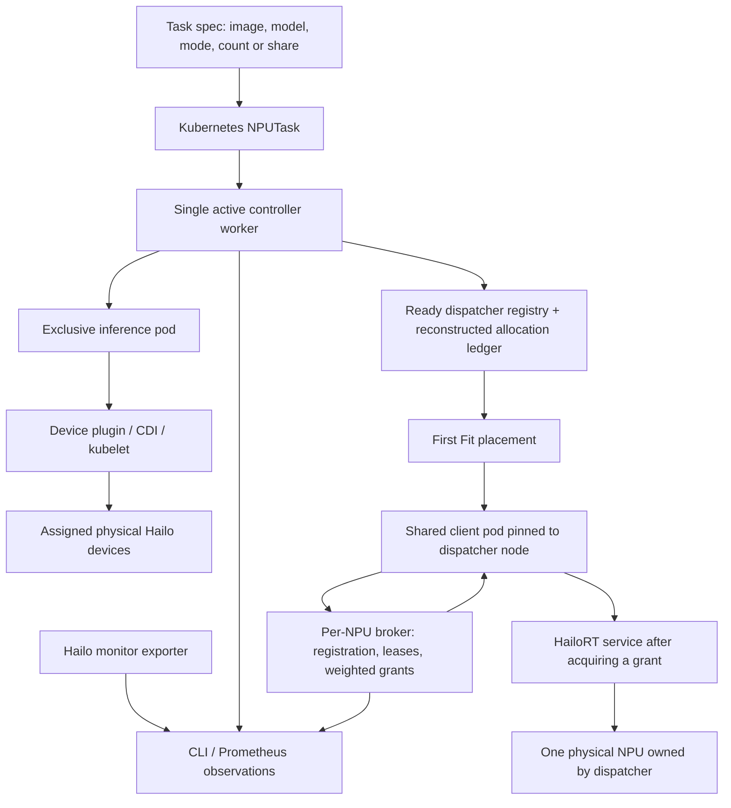
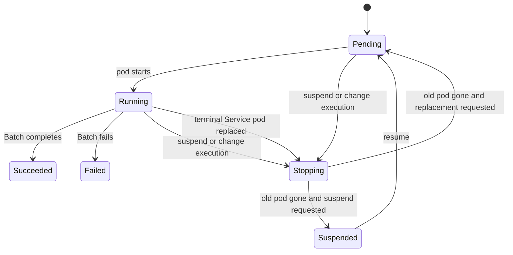
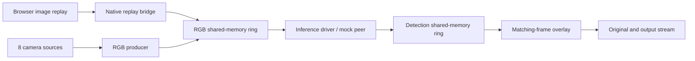

# Current OSH / managed NPU system model

This describes the implemented system at baseline commit `f09c5c4`, plus the
camera-free image replay harness. It is a working model for deciding changes,
tests, and evaluation scope. The visual application path and the managed shared
execution path are currently separate integrations.

## Components and boundaries



| Component | Responsibility | Implementation |
|---|---|---|
| NPUTask / controller | Desired execution, pod replacement, status, exclusive or shared admission | `npu-task/controller/` and `npu-task/deploy/crd.yaml` |
| Device plugin / CDI | Physical device discovery and pod isolation | `npu-task/plugin/` |
| Resource manager / registry | Logical device inventory, allocation reconstruction, First Fit | `npu-task/resource/`, `npu-task/sharing/` |
| Per-NPU dispatcher | Own one device, serve HailoRT, broker execution opportunities | `npu-task/dispatcher/`, `npu-task/shared/` |
| Shared client | Register, heartbeat, acquire, infer, release | `npu-task/shared/src/shared_runner.cpp` |
| Visual producer and consumer | RGB capture/replay, notifications, detection overlays | `camera/`, `comm/`, `image-stream/` |
| Visual inference worker | Explicit device selection and YOLO detection decoding | `inference/src/inference_driver.cpp` |
| Observation | Device/model utilization, FPS, logical share, grants, task state | `npu-task/tools/`, monitor exporter, controller/broker metrics |

## Resource and execution model

Let physical dispatcher device `i` have capacity `C_i = 1000`. A shared workload
`w` requests integer share `s_w` in `[1, 1000]` and receives one assignment
`a(w) = i`. It does not span devices. For each device:

```text
allocated_i = sum(s_w for allocations assigned to i)
available_i = C_i - allocated_i
0 <= allocated_i <= C_i
```

First Fit chooses the first healthy eligible dispatcher with sufficient logical
capacity. The controller reconstructs allocations from active workload pod
annotations, persists the assignment in pod/status fields, injects HailoRT and
scheduler addresses, and pins the client to the dispatcher's node. The current
single worker serializes admission; a durable atomic allocation ledger is needed
before enabling concurrent reconciliation.

For the exclusive path, `npuCount` is an integer from 1 to 8. Kubernetes schedules
the pod on one node, requesting that many `hailo.ai/npu` devices. Device isolation
and explicit selection determine the accessible devices. A task supplies exactly
one of `npuCount` or `npuShare`.

For sharing, each ready client acquires a broker grant before issuing its
HailoRT inference call, then releases the grant. Smooth weighted round robin
uses share as relative execution opportunity weight among ready queues. It is
not a reservation of FPS, time, or deadlines: model execution cost and residency
overhead affect latency and throughput. Broker sessions expire after 45 seconds
without activity; the reference client heartbeats every 10 seconds. A dispatcher
restart creates a new epoch.

Measured utilization `u_i(t)` is a separate observation. It does not subtract
from capacity or automatically permit over-allocation. Broker runtime sessions
and controller allocations are distinct states: session expiry removes stale
runtime registration; controller capacity is derived from workload pod state.

## Task lifecycle



Insufficient devices/share keeps a task Pending. Suspension and execution changes
terminate the old pod before admitting its replacement; resize has downtime.
Batch terminal results are retained without automatic retry. Service mode
restarts failed containers and replaces terminal pods. Running means process
availability, not proof of application readiness or inference accuracy. Task
deletion garbage-collects its pod. The system does not promise exactly-once
execution, preemption, FIFO admission, or a cross-node allocation.

## Visual frame model



Camera and replay producers are alternatives for a session, not simultaneous
writers. `OSH_TASK_ID` namespaces two POSIX shared-memory rings and two Unix
datagram sockets. Protocol version 2 has eight channels, three slots per channel,
and 24 total slots. Input is 640×640 RGB, 1,228,800 bytes per frame. Results hold
up to 256 records `(x0, y0, x1, y1, score, class_id)` in pixel coordinates.

Frame identity is `(task_id, cam_id, seq)`, with
`slot = cam_id * 3 + seq % 3`. Producers publish slot sequence after writing the
payload, then send `FRAME_READY` / `DETS_READY`. Receivers check slot sequence
and identity. The real driver keeps bounded per-camera queues and takes the
latest frame; older frames may be dropped. Each NPU worker owns a disjoint
round-robin subset of channels. The YOLO decoder remains model-specific.

The replay harness sends one frame at a time, retaining its original pixels
until matching detections arrive. This avoids overlaying results on a different
image and safely reuses slots without producer pressure. Mock mode substitutes
a deterministic marker peer using the same `comm` transport. External mode uses
the unchanged Hailo camera inference driver.

The shared benchmark runner currently feeds generated input and records execution
metrics; it has no camera IPC or decoded detection output. A future visual shared
client must join these interfaces explicitly, including preprocessing, model
decoding, grant lifecycle, and frame/result identity.

## Validation scope and next decisions

| Evidence | Establishes | Does not establish |
|---|---|---|
| Replay mock smoke test | All-channel IPC, sequence/slot reuse, deterministic result payload | Real inference, accuracy, Kubernetes or broker behavior |
| Replay with external driver | Camera-free real image inference and observable overlay | Fractional-sharing behavior |
| Saved exclusive/multi-model tests | Device isolation, lifecycle, capacity release | Application accuracy |
| Saved shared/recovery tests | First Fit, mixed clients, Pending/release, Service recovery | Formal fairness or production reliability |
| Formal campaign still to run | Repeated performance/recovery/fairness with confidence intervals | Throughput/deadline guarantees |

Near-term work should decide whether the next target is **visual shared-client
integration**, **formal measurement**, or **allocation/recovery hardening**.
Keep these invariants central: no overlapping pod generations, no allocation
above logical capacity, clients use assigned endpoints/devices, results preserve
frame identity, and utilization never masquerades as reserved capacity.

Production gaps remain: authenticated sessions, an atomic allocation ledger for
concurrent controllers, explicit Batch retry/checkpoint semantics, multi-node
validation, scoped transport mounts/credentials, dashboards, and upgrade policy.
See [NEXT_STEPS.md](npu-task/NEXT_STEPS.md) and
[MEASUREMENT_GUIDE.md](npu-task/MEASUREMENT_GUIDE.md).
